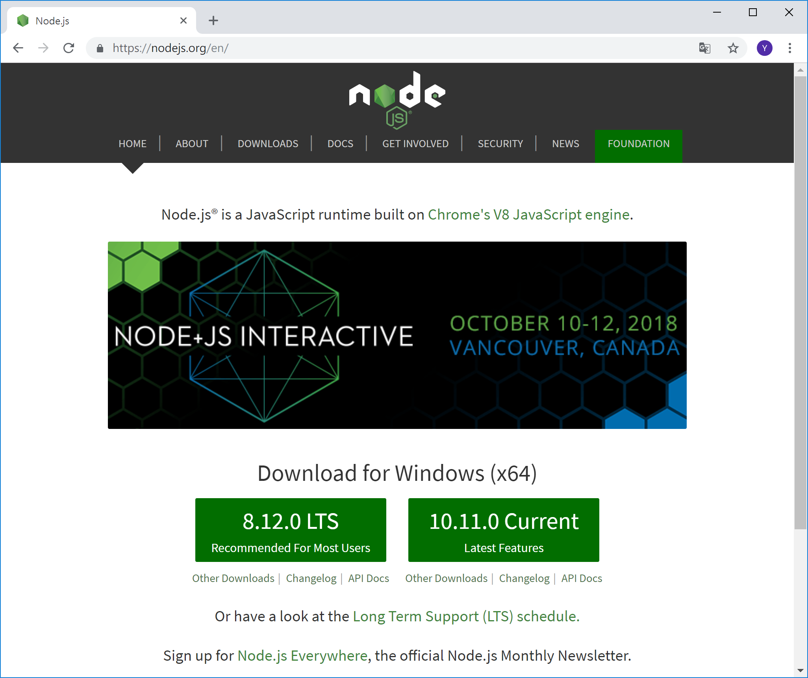
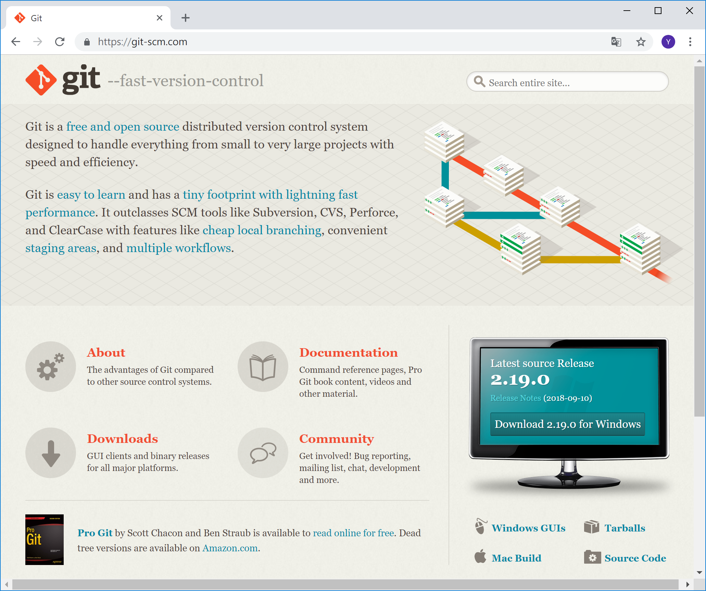
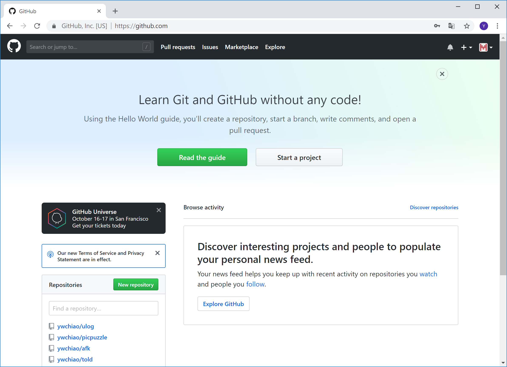
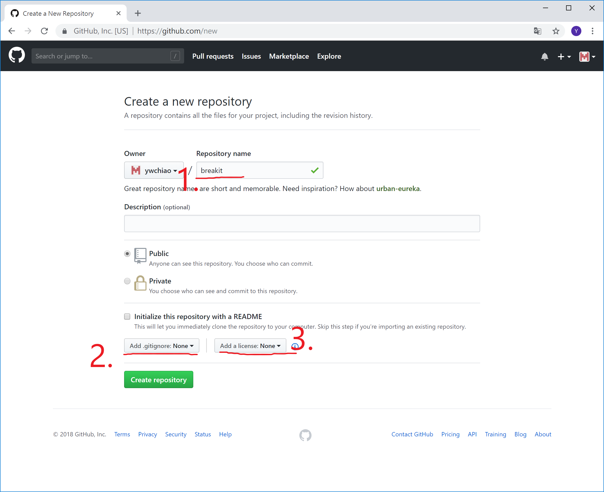
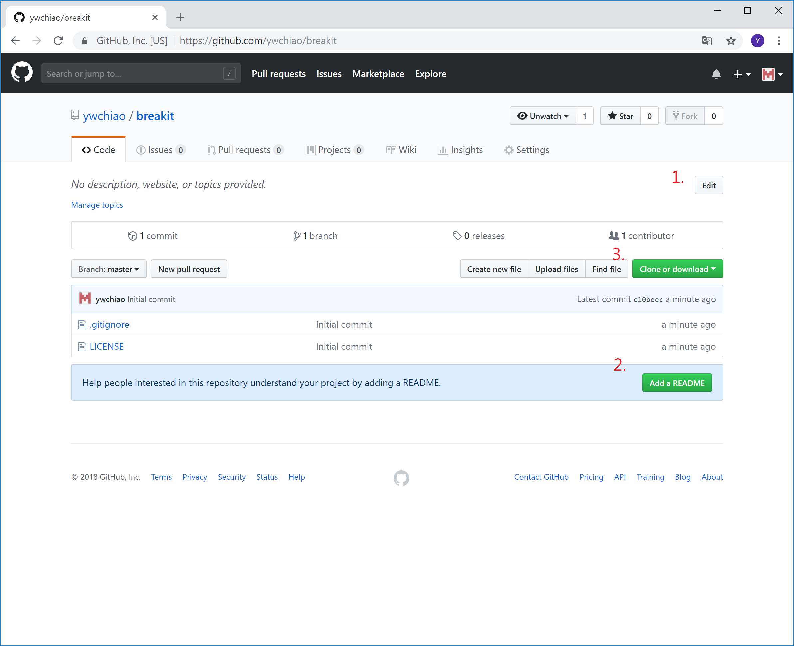
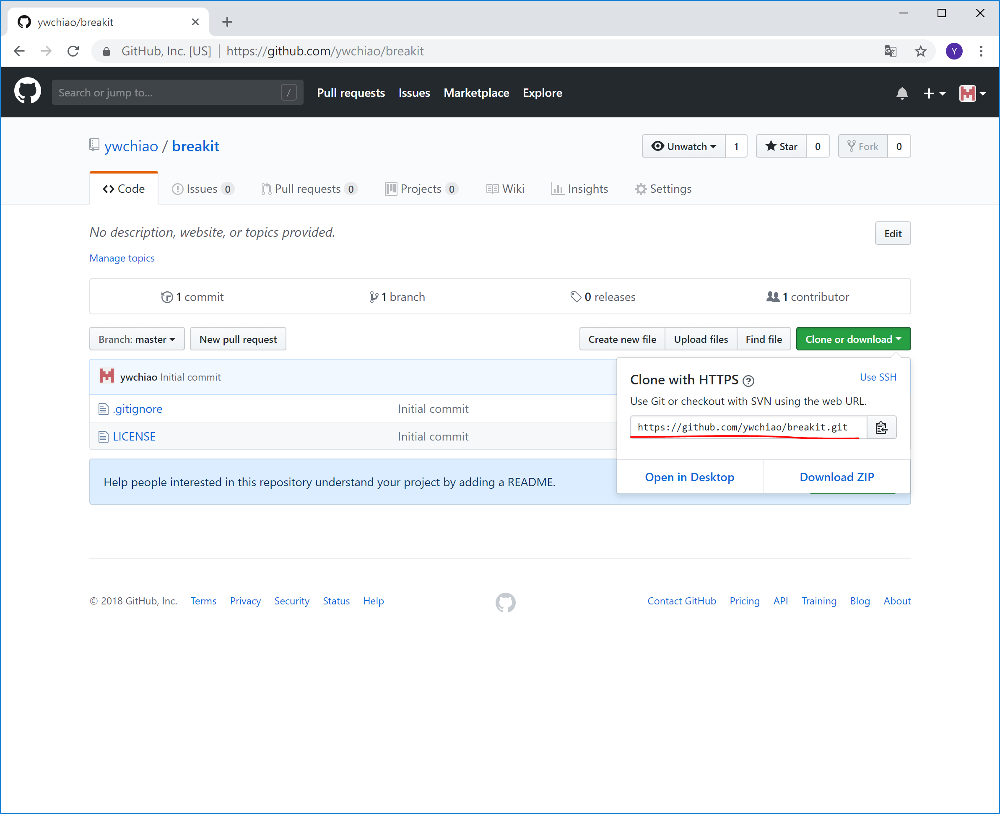
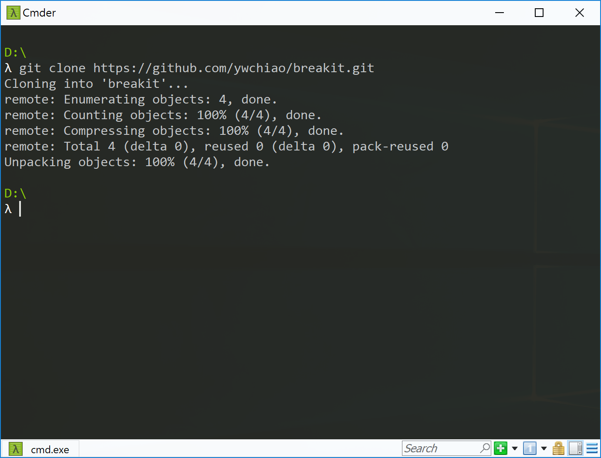

<!---
  @file       chapter_01.md
  @date       09/28/2018 created.
  @copyright  CC-BY, (C) 2017 Yiwei Chiao
  @detail
    This file is machine-generated. DONOT MODIFY IT DIRECTLY.
-->

# 簡介

  [Node.js][nodejs][^nodejs] 是以 Google Chrome V8 engine 為核心打造的
  一個 Javascript ([ECMAScript][][^ECMAScript]) 執行環境。
  在 [Node.js][nodejs] 的加持下，Javascript 脫離了 Web Browser 的羈絆，
  有了更廣闊的揮灑舞台。

  [Breakout][breakout][^breakout] (打磚塊) 是 1976 由 Atari Inc. 
  發行的一款電子遊戲。玩家操縱設於螢幕下方的一塊長方形檔板 (paddle)，
  將上方落下的球反彈，以擊破 (落) 列於螢幕上方的磚牆。將磚牆的全部
  磚塊擊落，則過關。

  [Breakout][breakout] 遊戲推出後，因為規則簡單，容易上癮 (addictive)，
  成為電子遊戲經典之一；並衍生成一個獨特的遊戲類型 (genre)。

  作為一個 [Node.js][nodejs]/Javascript 的練習專案，
  [BreakIt][breakit][^breakit] 嘗試撰寫以 [Node.js][nodejs]
  為基礎的 Web 版 [Breakout][breakout] 遊戲。

# 開發工具

  [BreakIt][] 使用
  [Node.js][nodejs] 撰寫。[Node.js][nodejs] 本身是一個龐雜的
  生態系 (eco-system)，如果之前沒有開發過 [Node.js][nodejs] 的專案，我們
  需要先安排好它的工作環境。基本上，我們會需要以下的工具 (tools)：

## [Node.js][nodejs]:

  Javascript/[ECMAScript][] 的工作的運作引擎。

## [Babel][babeljs][^babeljs]:

  Javascript 的 transpiler；Javascript 在 2009~2011 年間迎來了期待
  已久的真正意義上的標準化改變，但是既存的程式需要維護，瀏覽器 (browser) 的
  支援需要時間趕上。於是我們需要一個能將以新版 Javascript
  ([ECMAScript][] 6/7) 語言撰寫的程式**轉譯** (transpile)
  成瀏覽器/[Node.js][nodejs] 能理解的 Javascript 的工具。

  [Babel][babeljs] 就是這樣的一個工具。

## [rollup.js][rollupjs][^rollupjs]:

  [rollup.js][rollupjs] 是一個能將多個 .js 檔案打包 (pack) 成單一檔案，
  節省瀏覽器下載時間的工具；類似的工具早期有 [browserify][][^browserify]，
  近期當紅有 [webpack][][^webpack] 等。

  [BreakIt][breakit] 採用 [rollup.js][rollupjs]。

  開始時提過了，[Node.js][nodejs] 擁有一個龐雜的**生態系**，不同的問題常常
  都有多個不同的解決方案可供選擇，沒有對錯，只是要小心亂花迷眼。

## [git][][^git]:

  [git][] 是 [Linus Torvalds][torvalds][^torvalds] (是，就是 Linux
  Kernel 的原作者) 給現代的程式設計師 (programmer) 的另一個禮物；一個功能
  強大而又易用的**版本管理系統** ([Version Control System][vcs][^vcs])。

  在 [BreakIt][breakit] 專案裡，我們將使用 [git][] 來管控專案的發展。

## [GitHub][github][^github]:

  [GitHub][github] 不是一個工具，它是一個網站，一個雲服務。

  顧名思義，[GitHub][github] 是以 [git][] 為基礎架設的網路服務；
  無論如何，它是目前最熱的開源軟體集散地；包括**臉書** (Facebook)，
  **領英** (Linkedin)，**亞馬遜** (Amazon)，**谷歌** (Google)，
  所謂的 *FLAG* 就業首選，和**蘋果** (Apple)，**微軟** (Microsoft)
  都將它們開源的軟體放在 [GitHub][github] 上，就可以知道它的熱門程度。

  對程式設計師而言，因為 [GitHub][github] 承載了大量的開源專案，所以已成為
  學習，分享，交流，認識世界同時也被世界看到的場域。所以，儘早加入這個程式設計
  師的社群網絡，對程式設計師的職涯發展絶對是正向的影響。

  [BreakIt][breakit] 的源碼當然也放在 [GitHub][github] 上。
  對開源軟體而言，[GitHub][github] 的服務是**免費** 的；而我們的練習專案
  當然是開源的。所以實在沒有理由不去登錄一個 [GitHub][github] 的帳號。

  隨著專案的進展，我們也將慢慢地熟悉 [git][]/[GitHub][github] 的使用。

## [Atom][atom][^atom] (選擇性):

  [Atom][atom] 是 [GitHub][github] 推出的，以 [Node.js][nodejs] 打造的開源
  文字編輯器 (editor)；v1.21 版之後，更和 Facebook 合作將它擴張成一個完整的
  [IDE][ide][^ide]。

  關於 [Node.js][nodejs]/Javascript 可以作些什麼，[Atom][atom] 作了一個強而
  有力的見証；類似的，微軟 (Microsoft) 推出了以
  [Node.js][nodejs]/[TypeScript][typescript][^typescript]
  (微軟版 Javascript) 開發的 [VS Code][vscode][^vscode]。

## [terser][][^terser] (選擇性):

  [terser][] 是以 Javascript 撰寫的 Javascript 程式碼混淆工具，
  最小化工具，壓縮工具，最佳化工具。

  因為瀏覽器端執行的 Javascript 程式需要由伺服端下載，所以程式的大小愈小愈好，
  如此可以減少網路流量的使用，加快下載速度。[terser][] 就是為這個目的
  設計的工具，透過移除不會使用到的程式碼，變數改名，程式碼壓縮等動作，產生的結
  果和原始輸入可以有三到四倍的差異。

# 環境設定

## [Node.js][nodejs]:

  故事總是由 [Node.js][nodejs] 的安裝開始。依據作業系統的不同，有不同的流程。

### Windows:

  

  Figure \ref{nodejs} 是 [Node.js][nodejs] 的首頁；點擊 Figure
  \ref{nodejs} 畫面右下的 [Current] 就可以取得當前版本的
  [Node.js][nodejs]。下載的檔案是 .msi 檔，直接選執行，接受授權條款，選擇
  安裝位置，就完成了。

  [Node.js][nodejs] 因為持續演進，所以一直保持著同時有兩 (2) 條
  版本線在發行： *LTS*: Long Term Support (長期維護) 版本 和 *Current*
  (目前開發) 版本。

  原則上，每個**版本** 的**開發周期** (current) 是六 (6) 個月；開發周期
  結束，如果是 *LTS* 版本，那麼會有額外的十八 (18) 個月的**生命周期**；
  如果，不是 LTS 版本，那麼直接結束，不會再有任何更新。 *LTS* 版本生命
  周期結束後，還會有十二 (12) 個月的**維護** 週期，也就是會收到 bug 修復
  更新；再之後才結束。

  一般而言，**偶數** 版號的版本會是 *LTS* 版本，而奇數版本的版本不是。

### Linux/MacOS:

  如果電腦系統是 Linux/MacOS，因為 [Node.js][nodejs] 演化快速，建議安裝
  [nvm][][^nvm] ([Node Version Manager][nvm])，再透過 [nvm][] 安裝管
  理不同版本的 [Node.js][nodejs]。

### MacOS/[Homebrew][brew][^brew]:

  當然在 MacOS 上如果不需要在多個 [Node.js][nodejs] 版本中切換，那麼直接用
  [Homebrew][brew] 來安裝 [Node.js][nodejs] 也是一種方法。

  注意，[nvm][] 團隊有聲明**不** 支援 [Homebrew][brew] 安裝；所以，不要混
  用 [nvm][] 和 [Homebrew][brew]。任選一種方式就好。

## [git][]:

  [BreakIt][breakit] 練習專案使用
  [git][]/[GitHub][github]，所以我們需要 [git][]：

### Windows:

  

  [Git][git] 的首頁如 Figure \ref{git}；點擊 Figure \ref{git} 右下的
  *Downloads for Windows* 就可以開始下載。

  下載後執行，基本上如果你不知道它問的選項是什麼意思就按下一步就好；反之，如果你
  知道它選項的意思，那你也已經知道你要選什麼了。

  - [cmder][][^cmder]:

    因為 Windows 的**命令提示字元** 真的只能說是堪用而已，而 [git][]
    基本上又是個 [*CLI*][cli][^cli] ([Command-Line Interface][cli]，
    相對於 [*GUI*][gui][^gui]: [Graphical User Interface][gui]) 工具；
    所以，既然都已經要下載安裝 [git][] 了，不如順便就下載安裝一個好用點的
    命令提示字元工具，[cmder][] 。

    岔題，其實有不少 [*GUI*][gui] 工具都整合/支援了 [git][] 的功能。比如
    說，[GitHub][github] 推出的 [atom][]。只是，如果不熟悉
    [git][] 操作的話，看到 [*GUI*][gui] 上的一堆操作可能還是墬於五里霧中，
    不知道什麼是什麼。所以，還是建議由 [*CLI*][cli] 入手，之後再由
    [*GUI*][gui] 來簡化操作。

    這裡有兩 (2) 個選擇，

    1. 完整版 [cmder][] + [git][]:
      [cmder][] 的作者很貼心的將 [git][] 整合到 [cmder][] 的發行檔內，
      省去使用者另外下載安裝的繁瑣。
    1. 精簡版 [cmder][] *mini*:
      如果已經安裝了 [git][]，或者想自行安裝維護 [git][]，可以選擇 *mini*
      版，只有 6M 大小。

    不管那個選擇，下載的都是壓縮檔。下載完，解壓縮到喜歡的資料夾，如 Figure \ref{cmder}，最後再將 Figure \ref{cmder} 中的 cmder.exe 建立一個
    捷徑，放到桌面上方便取用就行了。

    

### Linux/MacOS:

  如果是 Linux/MacOS 作業環境，其本上系統都內建 [git][]。如果在 MacOS 環境
  下找不到 [git][]：

  1. 請記得 [git][] 是 [*CLI*][cli] 工具，到 *terminal* 下去執行。
  1. 先確認有沒有安裝 [*Xcode*][xcode][^xcode]，Apple 的官方
    [IDE][ide]；其次，在 [*Xcode*][xcode] 的 *Preferences* 裡確認
    有沒有安裝 *Xcode Command-Line Tools*。

  Linux 的話。各發行版都不同，基本上都整合在關於程式開發的套件內，並預設安裝。
  如果在 *terminal* 裡找不到，先到發行版的套件庫裡找找。

## [atom][] (選擇性):

  [atom][] 是 [GitHub][github] 推出的開源編輯器/[IDE][ide]，內建支援
  [git][]/[GitHub][github] 是自然的事；

  如果不習慣在命令列下工作，比如說使用 [git][]，可以試試 [atom][] 或其它的
  [ide][]。

  [breakit][] 專案本身並不仰賴在 [atom][]。比如說，雖然這份文
  件是用 [atom][] 寫作完成的，但我個人一般還是習慣用 [Vim][vim][^vim]
  工作。

  原則上，這樣環境設定就完成了。之前工具介紹提到的
  [Babel][babeljs]，[rollup.js][rollupjs] 等，都
  會在專案進展到那兒時，透過 [Node.js][nodejs] 隨附的 [npm][][^npm]
  ([Node Package Manager][npm]) 安裝。

# [GitHub][github] 基本使用

## 登錄 (sign up) [GitHub][github] 帳號

  1. [GitHub][github] 的登錄畫面很簡單，如 Figure \ref{github_signup}，
    僅需要帳號名稱，電子信箱，和密碼。

    

    登錄完記得回信箱收認証信。

  1. 用新建的帳號登入後，因為是首次登入，[GitHub][github] 會讓你選擇服務類
    型：

    

    [GitHub][github] 預設是免費，無限的開源專案；如果你想付點錢將專案藏起來，它也有選項給你。

    按 Figure \ref{github_type} 左下方綠色的 [Continue] 繼續。

  1. 第三個畫面 (Figure \ref{github_survey})會問你一些簡單，不涉隱私的資
    料，可以選擇回答，也可以跳過。

    

  1. 終於到最後一個畫面了，

    

    Figure \ref{github_main} 左邊的按鈕是 [GitHub][github] 教學，右邊
    則是 [**建立專案**]，選擇[**建立專案**]。如果之前還沒有去登錄的信箱收取
    認証信，這時你會看到 Figure \ref{github_verify}：

    

    記得回登錄的信箱去收認証信。

## 建立專案 (project)  

  在 [GitHub][github] 建立新專案，也稱作建立一個 *repository*，
  其實就是在檔案系統裡建立個存放程式碼相關檔案的資料夾 (folder)。
  建立專案的畫面如 Figure \ref{github_new} 所示。

  

  1. 首先輸入[**專案**]名稱
  1. 選擇 [.gitignore][gitignore][^gitignore] 檔案；這裡
    [GitHub][github] 貼心的幫忙準備了不同語言專案的通用
    [.gitignore][gitignore] 檔。下拉選擇
    [Node][nodejs]。[.gitignore][gitignore] 檔案的作用與目的
    後面說明。

    因為 [breakit][] 是 [Node.js][nodejs]
    的專案，所以這裡先選擇 [Node][nodejs]
  1. 授權方案 (License)。如果不知道該選那種授權或想多少理解一些不同授權的
    差別，旁邊的 *i* 按下去，有簡單的白話說明。個人一般選擇 [MIT][][^MIT]。

  在 Figure \ref{github_new} 按下 *Create Repository* 之後，就會進入專案
  的主頁 (homepage) 畫面。

### [.gitignore][gitignore]

  [.gitignore][gitignore] 檔案一個簡單的文字檔，用來記錄*不需要*放在
  *repository* 裡的檔案，檔案類型，與資料夾等資訊。

  舉例而言， C/C++ 的 .o/.obj 檔案， Java 的 .class 檔案，一般意義的
  tmp/ 資料夾，都是專案進行/程式編譯過程中，由工具產生的過渡產物，和我們的工作沒有直接關係，因此沒有必要放到 *repository* 內。

  因為不同的程式語言，不同的工具會有不同的過渡產出，[git][] 不可能事先知道，所
  以 [git][] 將決定權放到使用者手裡，由使用者編輯 [.gitignore][gitignore]
  檔案，告訴它那些檔案，資料夾是不重要，不需要管理的。

  [.gitignore][gitignore] 檔名前面那個**句點** (*period*, *dot*)，
  **不是** 打錯字，它是檔名的**一部份**。

  檔名由**句點**開始，在 Linux/MacOS 環境下代表**隱藏檔** (*hidden*)，意思
  是當使用者下 `dir` 或 `ls` 這類列出資料夾內容的指令時，系統**不會**顯示它
  的存在。

  而在 Windows 環境下，這個句點**沒有**作用，就只是檔名的一部份而已。

## 專案主頁

  [GitHub][github] 上每個專案的**主頁** (*homepage*)，都如 Figure
  \ref{github_project} 所示：
  Figure \ref{github_project} 因為是剛產生的專案，所以看起來空空的，可以
  開始動手添加些資訊。

  

  1. 按下 *Edit* 可以加上網頁的說明。
  1. 按下 *Add a README* 會進入網頁編輯器的畫面，編輯 *README.md* 檔案。說
    明這個專案的細節。等等再回頭來談關於 *README.md* 的事，現在先略過。
  1. 我們現在關心的是這個 *Clone or download*。展開後是這樣，

    

    這裡可以選擇將整個專案壓成一個 .zip 檔案下載，或者用 [GitHub][github]
    的客戶端下載。但目前我們關心的是 Figure \ref{github_proj_url} 中畫紅線
    的 *url*。

    開啟**命令提示字元** (或者，如果有安裝的話， [cmder][]；如果是
    Linux/MacOS，開啟 *terminal*。)

    輸入：
    `git clone your_url`；

    比如：
    `git clone https://github.com/ywchiao/breakit.git`

    然後，專案源碼就下載到本地端 (local) 的硬碟裡了。如 Figure
    \ref{git_clone}。

    

    之後的專案開發就會在本地端的這個資料夾下工作；再利用 [git][] 同步到
    [GitHub][github] 上。

## *README.md*

  *README* (讀我) 檔案用來記錄的專案的介紹，說明，注意事項等事宜。理想上，是
  專案使用者首先要閱讀的文件。因為使用者通常缺少耐心，所以 *README* 檔案裡最好
  只放關於專案的**簡單介紹** 和*一定* 要事先知道的**注意事項**。

  *README.md* 裡的 [.md][markdown] 指的則是
  [Markdown][markdown][^markdown] 標記語言。

### [Markdown][markdown]

  [Markdown][markdown] 是一個易學，易讀，易寫，易傳播的文件寫作標記語言。
  目前這份文件就是利用 [Markdown][markdown] 語言寫的。

  作為一個在網路叢林裡野蠻生長的個體，[Markdown][markdown] 和 Javascript
  有類似的問題，就是**方言** (*dialect*) 太多，不同的實作都在某些細節有些
  微妙的不同；或者有不同的語言擴充。

  標準化的努力稱作 [CommonMark][commonmark][^commonmark]，嘗試定義一個
  最小的共通語言核心，並嚴格定義這個核心標準的實作細節。[GitHub][github]
  已宣佈在核心部份支援 [CommonMark][commonmark]，另外再加上
  [GitHub][github] 自己定義的**語言擴充** (*extensions*)。
  [GitHub][github] 使用的 [Markdown][markdown] 方言就稱作
  [*GFM*][gfm][^gfm]: [GitHub Flavored Markdown][gfm]。

  幸運的是，不像 JavaScript，[Markdown][markdown] 不是程式語言；方言不同
  的影響只是當文件格式需要轉換的時候，如 md <-> HTML， md <-> pdf， md
  <-> epub 等，呈現的效果會有差異，基本上對閱讀的影響不大。

  [GitHub][github] 要求/假定專案說明的 *README* (讀我) 檔案需要以
  [Markdown][markdown] ([*GFM*][gfm]) 撰寫。

[ECMAScript]: https://en.wikipedia.org/wiki/ECMAScript
[breakit]: https://github.com/ywchiao/breakit
[breakout]: https://en.wikipedia.org/wiki/Breakout_(video_game)
[nodejs]: https://nodejs.org
[atom]: https://atom.io
[babeljs]: https://babeljs.io
[browserify]: http://browserify.org
[git]: https://git-scm.com
[github]: https://github.com
[ide]: https://en.wikipedia.org/wiki/Integrated_development_environment
[rollupjs]: https://rollupjs.org
[terser]: https://github.com/terser-js/terser
[torvalds]: https://en.wikipedia.org/wiki/Linus_Torvalds
[typescript]: https://www.typescriptlang.org
[vcs]: https://en.wikipedia.org/wiki/Version_control
[vscode]: https://github.com/Microsoft/vscode
[webpack]: https://webpack.github.io
[brew]: https://github.com/Homebrew/brew
[cli]: https://en.wikipedia.org/wiki/Command-line_interface
[cmder]: https://github.com/cmderdev/cmder
[gui]: https://en.wikipedia.org/wiki/Graphical_user_interface
[npm]: https://www.npmjs.com
[nvm]: https://github.com/creationix/nvm
[vim]: https://vim.sourceforge.io
[xcode]: https://developer.apple.com/xcode
[commonmark]: http://commonmark.org
[gfm]: https://github.github.com/gfm
[gitignore]: https://git-scm.com/docs/gitignore
[markdown]: https://en.wikipedia.org/wiki/Markdown
[MIT]: https://opensource.org/licenses/MIT
[^ECMAScript]: https://en.wikipedia.org/wiki/ECMAScript
[^breakit]: https://github.com/ywchiao/breakit
[^breakout]: https://en.wikipedia.org/wiki/Breakout_(video_game)
[^nodejs]: https://nodejs.org
[^atom]: https://atom.io
[^babeljs]: https://babeljs.io
[^browserify]: http://browserify.org
[^git]: https://git-scm.com
[^github]: https://github.com
[^ide]: https://en.wikipedia.org/wiki/Integrated_development_environment
[^rollupjs]: https://rollupjs.org
[^terser]: https://github.com/terser-js/terser
[^torvalds]: https://en.wikipedia.org/wiki/Linus_Torvalds
[^typescript]: https://www.typescriptlang.org
[^vcs]: https://en.wikipedia.org/wiki/Version_control
[^vscode]: https://github.com/Microsoft/vscode
[^webpack]: https://webpack.github.io
[^brew]: https://github.com/Homebrew/brew
[^cli]: https://en.wikipedia.org/wiki/Command-line_interface
[^cmder]: https://github.com/cmderdev/cmder
[^gui]: https://en.wikipedia.org/wiki/Graphical_user_interface
[^npm]: https://www.npmjs.com
[^nvm]: https://github.com/creationix/nvm
[^vim]: https://vim.sourceforge.io
[^xcode]: https://developer.apple.com/xcode
[^commonmark]: http://commonmark.org
[^gfm]: https://github.github.com/gfm
[^gitignore]: https://git-scm.com/docs/gitignore
[^markdown]: https://en.wikipedia.org/wiki/Markdown
[^MIT]: https://opensource.org/licenses/MIT

<!--- chapter_01.md -->