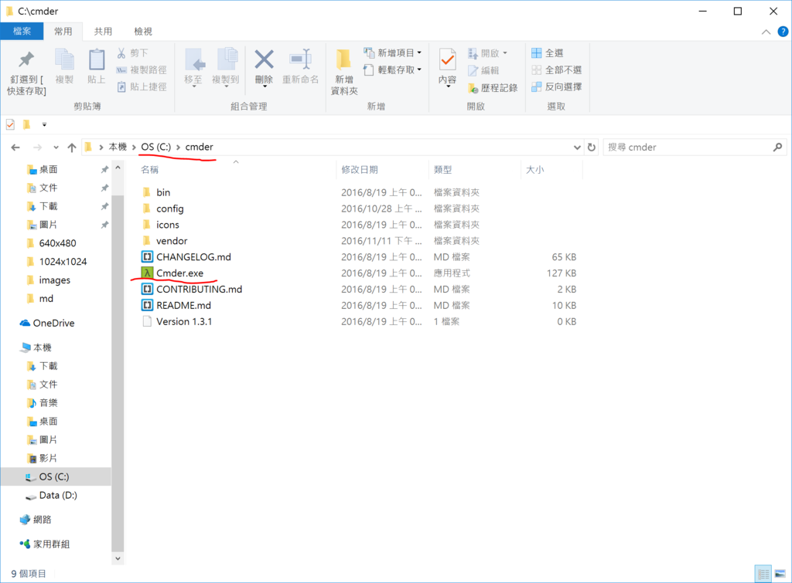

<!---
  @file       environment.md
  @author     Yiwei Chiao (ywchiao@gmail.com)
  @date       09/21/2017 created.
  @date       09/28/2018 last modified.
  @version    0.1.0
  @copyright  CC-BY, © 2017-2018 Yiwei Chiao
-->

# 環境設定

## [Node.js][nodejs][^nodejs]:

  故事總是由 [Node.js][nodejs] 的安裝開始。依據作業系統的不同，有不同的流程。

### Windows:

  

  Figure \ref{nodejs} 是 [Node.js][nodejs] 的首頁；點擊 Figure
  \ref{nodejs} 畫面右下的 [Current] 就可以取得當前版本的
  [Node.js][nodejs]。下載的檔案是 .msi 檔，直接選執行，接受授權條款，選擇
  安裝位置，就完成了。

  [Node.js][nodejs] 因為持續演進，所以一直保持著同時有兩 (2) 條
  版本線在發行： *LTS*: Long Term Support (長期維護) 版本 和 *Current*
  (目前開發) 版本。

  原則上，每個**版本** 的**開發周期** (current) 是六 (6) 個月；開發周期
  結束，如果是 *LTS* 版本，那麼會有額外的十八 (18) 個月的**生命周期**；
  如果，不是 LTS 版本，那麼直接結束，不會再有任何更新。 *LTS* 版本生命
  周期結束後，還會有十二 (12) 個月的**維護** 週期，也就是會收到 bug 修復
  更新；再之後才結束。

  一般而言，**偶數** 版號的版本會是 *LTS* 版本，而奇數版本的版本不是。

### Linux/MacOS:

  如果電腦系統是 Linux/MacOS，因為 [Node.js][nodejs] 演化快速，建議安裝
  [nvm][][^nvm] ([Node Version Manager][nvm])，再透過 [nvm][] 安裝管
  理不同版本的 [Node.js][nodejs]。

### MacOS/[Homebrew][brew][^brew]:

  當然在 MacOS 上如果不需要在多個 [Node.js][nodejs] 版本中切換，那麼直接用
  [Homebrew][brew] 來安裝 [Node.js][nodejs] 也是一種方法。

  注意，[nvm][] 團隊有聲明**不** 支援 [Homebrew][brew] 安裝；所以，不要混
  用 [nvm][] 和 [Homebrew][brew]。任選一種方式就好。

## [git][][^git]:

  [BreakIt][breakit][^breakit] 練習專案使用
  [git][]/[GitHub][github][^github]，所以我們需要 [git][]：

### Windows:

  

  [Git][git] 的首頁如 Figure \ref{git}；點擊 Figure \ref{git} 右下的
  *Downloads for Windows* 就可以開始下載。

  下載後執行，基本上如果你不知道它問的選項是什麼意思就按下一步就好；反之，如果你
  知道它選項的意思，那你也已經知道你要選什麼了。

  - [cmder][][^cmder]:

    因為 Windows 的**命令提示字元** 真的只能說是堪用而已，而 [git][]
    基本上又是個 [*CLI*][cli][^cli] ([Command-Line Interface][cli]，
    相對於 [*GUI*][gui][^gui]: [Graphical User Interface][gui]) 工具；
    所以，既然都已經要下載安裝 [git][] 了，不如順便就下載安裝一個好用點的
    命令提示字元工具，[cmder][] 。

    岔題，其實有不少 [*GUI*][gui] 工具都整合/支援了 [git][] 的功能。比如
    說，[GitHub][github] 推出的 [atom][][^atom]。只是，如果不熟悉
    [git][] 操作的話，看到 [*GUI*][gui] 上的一堆操作可能還是墬於五里霧中，
    不知道什麼是什麼。所以，還是建議由 [*CLI*][cli] 入手，之後再由
    [*GUI*][gui] 來簡化操作。

    這裡有兩 (2) 個選擇，

    1. 完整版 [cmder][] + [git][]:
      [cmder][] 的作者很貼心的將 [git][] 整合到 [cmder][] 的發行檔內，
      省去使用者另外下載安裝的繁瑣。
    1. 精簡版 [cmder][] *mini*:
      如果已經安裝了 [git][]，或者想自行安裝維護 [git][]，可以選擇 *mini*
      版，只有 6M 大小。

    不管那個選擇，下載的都是壓縮檔。下載完，解壓縮到喜歡的資料夾，如 Figure \ref{cmder}，最後再將 Figure \ref{cmder} 中的 cmder.exe 建立一個
    捷徑，放到桌面上方便取用就行了。

    

### Linux/MacOS:

  如果是 Linux/MacOS 作業環境，其本上系統都內建 [git][]。如果在 MacOS 環境
  下找不到 [git][]：

  1. 請記得 [git][] 是 [*CLI*][cli] 工具，到 *terminal* 下去執行。
  1. 先確認有沒有安裝 [*Xcode*][xcode][^xcode]，Apple 的官方
    [IDE][ide][^ide]；其次，在 [*Xcode*][xcode] 的 *Preferences* 裡確認
    有沒有安裝 *Xcode Command-Line Tools*。

  Linux 的話。各發行版都不同，基本上都整合在關於程式開發的套件內，並預設安裝。
  如果在 *terminal* 裡找不到，先到發行版的套件庫裡找找。

## [atom][] (選擇性):

  [atom][] 是 [GitHub][github] 推出的開源編輯器/[IDE][ide]，內建支援
  [git][]/[GitHub][github] 是自然的事；

  如果不習慣在命令列下工作，比如說使用 [git][]，可以試試 [atom][] 或其它的
  [ide][]。

  [breakit][] 專案本身並不仰賴在 [atom][]。比如說，雖然這份文
  件是用 [atom][] 寫作完成的，但我個人一般還是習慣用 [Vim][vim][^vim]
  工作。

  原則上，這樣環境設定就完成了。之前工具介紹提到的
  [Babel][babeljs][^babeljs]，[rollup.js][rollupjs][^rollupjs] 等，都
  會在專案進展到那兒時，透過 [Node.js][nodejs] 隨附的 [npm][][^npm]
  ([Node Package Manager][npm]) 安裝。

[atom]: https://atom.io
[babeljs]: https://babeljs.io
[breakit]: https://github.com/ywchiao/breakit
[brew]: https://github.com/Homebrew/brew
[cli]: https://en.wikipedia.org/wiki/Command-line_interface
[cmder]: https://github.com/cmderdev/cmder
[git]: https://git-scm.com
[github]: https://github.com
[gui]: https://en.wikipedia.org/wiki/Graphical_user_interface
[ide]: https://en.wikipedia.org/wiki/Integrated_development_environment
[nodejs]: https://nodejs.org
[npm]: https://www.npmjs.com
[nvm]: https://github.com/creationix/nvm
[rollupjs]: https://rollupjs.org
[vim]: https://vim.sourceforge.io
[xcode]: https://developer.apple.com/xcode

[^atom]: https://atom.io
[^babeljs]: https://babeljs.io
[^breakit]: https://github.com/ywchiao/breakit
[^brew]: https://github.com/Homebrew/brew
[^cli]: https://en.wikipedia.org/wiki/Command-line_interface
[^cmder]: https://github.com/cmderdev/cmder
[^git]: https://git-scm.com
[^github]: https://github.com
[^gui]: https://en.wikipedia.org/wiki/Graphical_user_interface
[^ide]: https://en.wikipedia.org/wiki/Integrated_development_environment
[^nodejs]: https://nodejs.org
[^npm]: https://www.npmjs.com
[^nvm]: https://github.com/creationix/nvm
[^rollupjs]: https://rollupjs.org
[^vim]: https://vim.sourceforge.io
[^xcode]: https://developer.apple.com/xcode

<!--- environment.md -->
