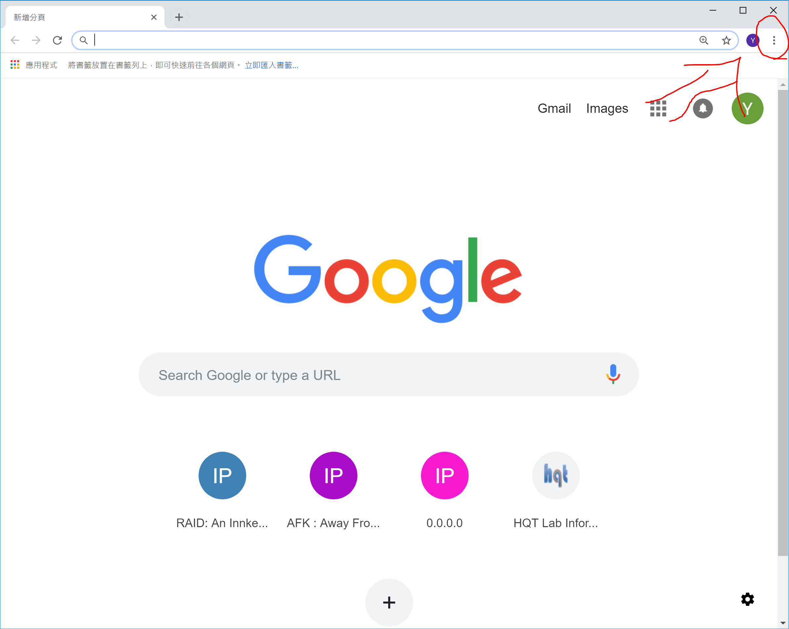
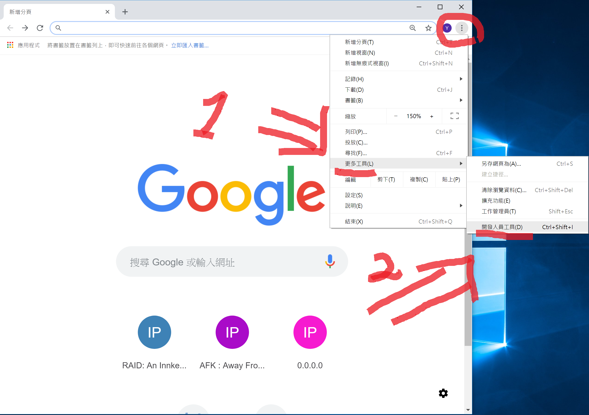
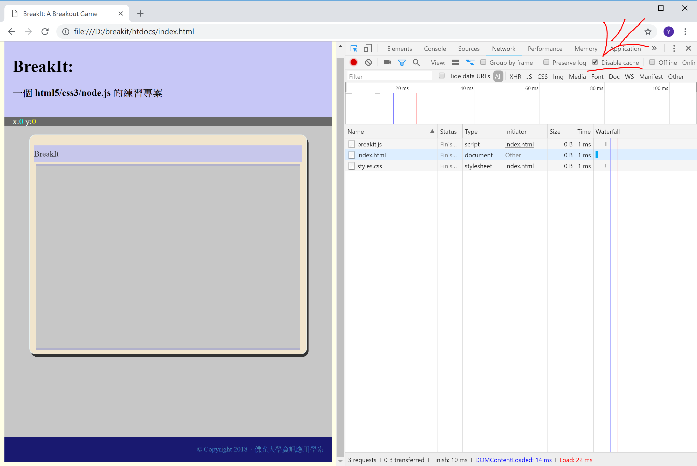
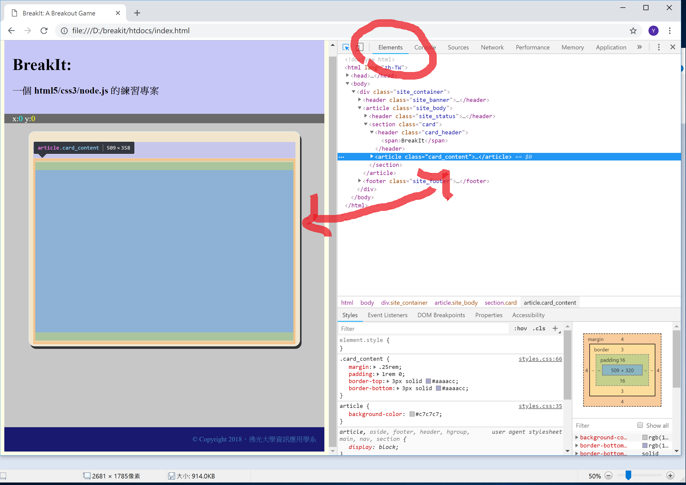
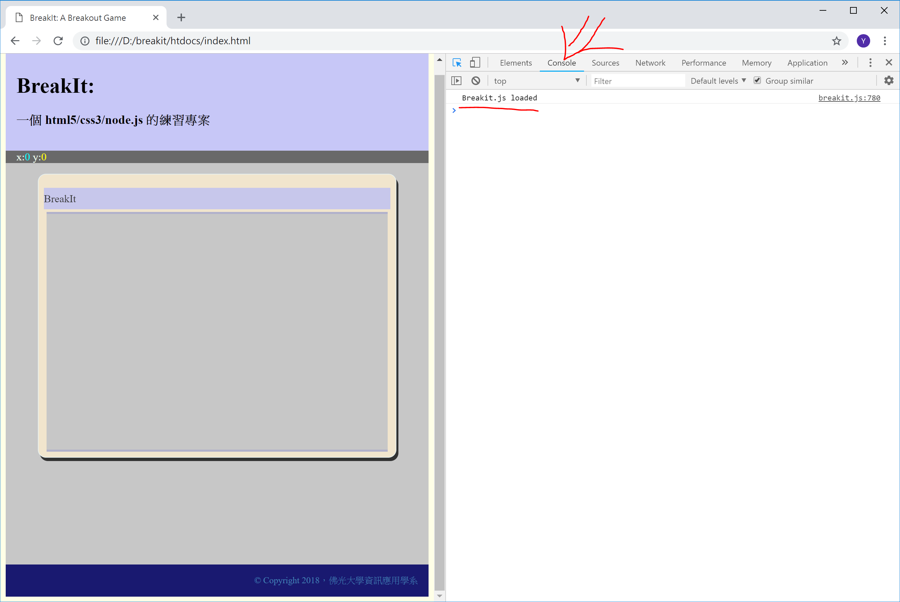
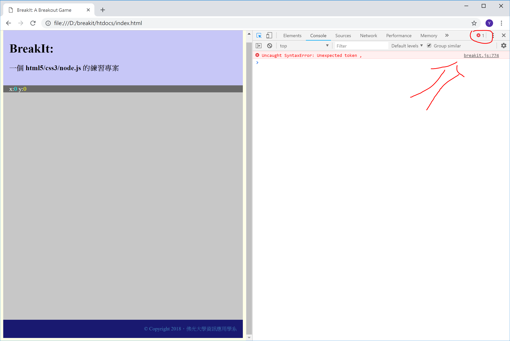

<!---
  @file       intro.md
  @author     Yiwei Chiao (ywchiao@gmail.com)
  @date       12/08/2017 created.
  @date       10/11/2018 last modified.
  @version    0.1.0
  @copyright  CC-BY, © 2017-2018 Yiwei Chiao
-->

# 導論

 程式開發過程裡一件最重要的事就是知道目前電腦裡發生了什麼事，程式設計師才能由此
 找出程式的錯誤或改變程式行為。

 現代的網頁瀏覽器，因為網頁應用程式的普及，也都內建了讓程式設計師了解網頁內部
 行為的工具，以協助網頁程式設計師完成工作。這裡以 Google [Chrome][chrome]
 為例，一窺瀏覽器在這個面向可以給我們什麼幫助。

 

## 專案準備

 為了了解 [Chrome][chrome] 的開發人員工具，請先準備好下面的檔案：

  * `index.html`: 放在 `breakit/htdocs` 資料夾下。
  * `styles.css`: 放在 `breakit/htdocs/asssets/css` 資料夾下。
  * `breakit.js`: 放在 `breakit/htdocs/js` 資料夾下。

 這三個檔案的作用：

  * `index.html`: 使用者瀏覽/網路爬蟲爬梳時，看到的網頁頁面。記錄了基本的
  網站資訊，如文字編碼，主題資訊等。也作為通知瀏覽器，後續 Web 資源，如
   `.js`，`.css` 等檔案的 `url` 資訊。
  * `styles.css`: 網頁的設計風格設定檔。網站的視覺風格由 `.css` 檔案決定。
  一個好的網站設計應該可以利用切換不同的 `.css` 檔作到不同的視覺呈現。
  * `breakit.js`: [Breakit][breakit] 專案的客戶端程式。`.html` 提供了
  頁面的骨架，`.css` 為骨架加上了衣服，而 `.js` 是血肉。有了 `.js`，網頁才
  真正有了生命。

 三個檔案準備好了以後，啟動 `breakit/httpd` 下的網頁伺服，可以準備來看看
 [Chrome][chrome] 的開發工具。

   

## [Chrome][chrome] 開發人員工具

 啟動 [Chrome][chrome] 瀏覽器，如圖 Figure \ref{chrome}，注意畫面右上角
 的按紐。那裡是開啓 [Chrome][chrome] ([Firefox][firefox] 也是) 瀏覽器
 設定的地方。

 打開後，如圖 Figure \ref{chrome:tool}，找到 \[開發人員工具\]，開啟它。
 開啟後，瀏覽器的畫面應該很類似圖 Figure \ref{chrome:debug_init} 的樣子。
 先如圖 Figure \ref{chrome:debug_init} 所示，找到 \[network\] 標籤下
 的 \[Disable Cache\] 將 [Chrome][chrome] 的**快取** (*cache*) 保持
 **關閉** (*disabled*)，以確保網頁開發過程中，瀏覽器執行的確定是最新修定的
 版本。

 同樣如圖 Figure \ref{chrome:debug_init} 所示， \[network\] 標籤下，
 可以看到瀏覽器和伺服器間的資料傳輸網路延遲等資訊，那些在開發大型網站應用作優
 化時是很重要的資訊。不過目前知道有它存在就好，暫時可以不用管它。

  

 將快取關閉後，就可以回頭來看最常接觸的兩個標籤：\[Elements\] 和 \[Console\] 了。

## [Chrome][chrome] \[Elements\] 標籤

 \[Elemtns\] 指得是 [HTML][mdnHTML5] 和 [CSS][mdnCSS]。在這個頁籤，可以
 看到\[開發人員工具\]上半部的畫面，顯示的是 [HTML][mdnHTML5] 的內容；而下半
 部則是 [CSS][mdnCSS] 的樣子。

  

 如圖 Figure \ref{chrome:debug_element} 所示，試著在\[Elements\]
 顯示的 [HTML][mdnHTML5] 標籤上移動滑鼠，可以注意到畫面左邊也有視覺變化的
 效果。那是 [Chrome][chrome] 在標示滑鼠所在的 [HTML][mdnHTML5] 標籤，
 在網頁上呈現的效果和範圍大小。

 所以，有這個頁面協助，設定 [HTML][mdnHTML5] 與 [CSS][mdnCSS] 就不用再憑空
 想像，而可以實時看到效果。

## [Chrome][chrome] \[Console\] 標籤

 在寫 [Node.js][nodejs] 程式時，可以利用 `console.log(...)` 在螢幕上輸出
 訊息以理解程式內部實際發生的事情；同樣的 `console.log(...)` 在瀏覽器裡，就是
 輸出到這個 \[Console\] 頁籤。

   

 可以打開 `breakit/htdocs/js/index.js` 看到程式一開始就有一行 `console.log(...)`，和圖 Figure \ref{chrome:debug_console} 裡顯示的相同。

```javascript
window.addEventListener('load', () => {
  console.log('Breakit.js loaded');
};
```

 而如果網頁程式執行有**錯誤**發生，[Chrome][chrome] 的 \[console\] 頁籤會
 如圖 Figure \ref{debug_error} 所顯示。右上角會有紅色的數字顯示程式中止前的
 錯誤個數；而 \[Console\] 視窗則會顯示出錯的程式碼和它的 `.js` 檔名與行號。

   

## 問題與練習

 1. 在 \[Elements\] 裡移動滑鼠游標，嘗試理解它的顯示和作用。
 1. 利用文字編輯器 (如 `atom`)，打開 `htdocs/index.html` 比較它的內容和
  \[Elements\] 顯示的內容。好像有些不大一樣？將 `htdocs/js/index.js` 裡
  `console.log(...)` 後的內容都註解掉，再比對看看內容是否相同？研究一下？

[chrome]: https://www.google.com.tw/chrome
[firefox]: https://www.mozilla.org/zh-TW/firefox/
[mdnCSS]: https://developer.mozilla.org/en-US/docs/Web/CSS  
[mdnHTML5]: https://developer.mozilla.org/en-US/docs/Web/Guide/HTML/HTML5
[nodejs]: https://nodejs.org
[breakit]: https://github.com/ywchiao/breakit.git

<!-- intro.md -->
