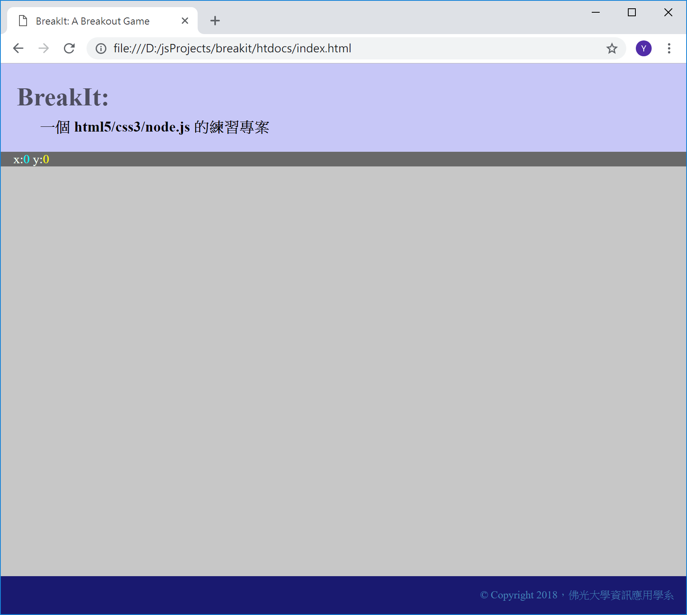

<!---
  @file       intro.md
  @author     Yiwei Chiao (ywchiao@gmail.com)
  @date       10/19/2018 created.
  @date       10/19/2018 last modified.
  @version    0.1.0
  @copyright  CC-BY, © 2018 Yiwei Chiao
-->

# 前言

 前一章對 [DOM][mdnDOMl] 有了基本的輪廓認識。這一章開始慢慢進入
 [Breakit][breakit] 專案的建構。

## 專案準備

 由之前建立的概念了解，[Breakit][breakit] 專案基本需要下面這些檔案才能
 運作：

  * `index.html`: 放在 `breakit/htdocs` 資料夾下。
  * `styles.css`: 放在 `breakit/htdocs/asssets/css` 資料夾下。
  * `index.js`: 放在 `breakit/htdocs/js` 資料夾下。

 這三個檔案的作用：

  * `index.html`: 使用者瀏覽/網路爬蟲爬梳時，看到的網頁頁面。記錄了基本的
  網站資訊，如文字編碼，主題資訊等。也作為通知瀏覽器，後續 Web 資源，如
  `index.js`，`styles.css` 等檔案的 `url` 資訊。
  * `styles.css`: 網頁的設計風格設定檔。網站的視覺風格由 `.css` 檔案決定。
  一個好的網站設計應該可以利用切換不同的 `.css` 檔作到不同的視覺呈現。
  * `breakit.js`: [Breakit][breakit] 專案的客戶端程式。`.html` 提供了
  頁面的骨架，`.css` 為骨架加上了衣服，而 `.js` 是血肉。有了 `.js`，網頁才
  真正有了生命。

## `index.html`

  首先，`index.html` 的內容如下：

```html
 1. <html lang="zh-TW">
 2.   <head>
 3.     <meta charset="utf-8">
 4.     <meta name="viewport" content="width=device-width, initial-scale=1.0">
 5.
 6.     <title>BreakIt: A Breakout Game</title>
 7.
 8.     <link rel="stylesheet" href="assets/css/styles.css">
 9.     <script src="js/breakit.js"></script>
10.   </head>
11.   <body>
12.     <div class="site-container">
13.       <header class="site-banner">
14.         <h1 class="site-title">BreakIt:</h1>
15.         <h3 class="site-subtitle">一個 html5/css3/node.js 的練習專案</h3>
16.       </header>
17.       <article class="site-body">
18.         <header class="site-status">
19.           <span>
20.             x:<span id="cursor-x">0</span>
21.             y:<span id="cursor-y">0</span>
22.           </span>
23.         </header>
24.       </article>
25.       <footer class="site-footer">
26.         <small class="float-right">
27.           &copy; Copyright 2017，佛光大學資訊應用學系
28.         </small>
29.       </footer>
30.     </div>
31.   </body>
32. </html>
```

  其中，第 8 行載入 `styles.css`，而 `index.js` 則在第 9 行載入。
 快速瀏覽第 11 行到第 31 行之間的內容，可以看出它基本上就是建構了
 頁面的基本 head-content-footer 三段結構；同時，用一個 [CSS][mdnCSS]
 class 為 `site-container` 的 `<div>` 元素包裝起來。

 將第 11 行 `<body>` 到第 31 行 `</body>` 之間的內容用一個額外的
 `<div></div>` 包起來的原因在於，這可以將 `<body>` 內的所有內容變成
 [DOM][mdnDOM] tree 下的一顆完整的子樹，提供了整頁置換 (swap) 的彈性。

 第 11 行 `<body>` 到第 31 行 `</body>` 之間的每一個 `tag` 也都有指
 定一個 css class，去設定它的顯示風格。這些設定內容，都在 `styles.css`
 內可參考。

 目前執行畫面，如下圖 \ref{sketch}：

  

### [HTML][mdnHTML5] vs [DOM][mdnDOM]

  由之前的 [DOM][mdnDOM] 簡介知道，圖 \ref{sketch} 的效果可以全部
  利用 [JavaScript][mdnJavaScript] 操作 [DOM][mdnDOM] tree 來達成；
  換句話說，第 11 行到第 31 行之間的內容是可以省略的。這其實就是一
  個 *取捨* 或 *選擇* 的問題。

  在一個像 [BreakIt][breakit] 這樣的練習專案，其實兩者沒有什麼差別，
  端看著重的學習重心在那一方面；而若是一個嚴肅的正式專案，就可能會
  因為：

  * 分工：版面規畫，程式設計由不同人負責，
  * 效能與支援：
    - server rendering: 網頁版面在伺服端 (server) 建構完成，傳送
      到瀏覽器顯示；伺服負擔大量的運算，使用*靜態*的*樣版*
      (template) 可以減輕問題。
    - client rendering: 伺服端 (server) 僅傳送資料，網頁版面建構在
      客戶端 (瀏覽器 browser) 動態完成。問題使用者的瀏覽器可能不支
      援 JavaScript；或基於安全理由而關閉 JavaScript；

  這些考量而有不同的選擇。

  基本上，[BreakIt][breakit] 和大部份的專案相同，採用混合的模式。
  也就是，`index.html` 作為一個*靜態*的*模版* (**template**) 提供
  基本的版面規劃，具體的內容則由 [JavaScript][mdnJavaScript] 在客戶
  端直接操作 [DOM][mdnDOM] tree 來完成。

  因為作為一個互動式遊戲，除非採用*遊戲串流* (game streaming) 技術，
  否則不可能不在瀏覽器端進行 [JavaScript][mdnJavaScript]。

[breakit]: https://github.com/ywchiao/breakit.git
[mdnCSS]: https://developer.mozilla.org/en-US/docs/Web/CSS  
[mdnDOM]: https://developer.mozilla.org/en-US/docs/Web/API/Document_Object_Mode
[mdnHTML5]: https://developer.mozilla.org/en-US/docs/Web/Guide/HTML/HTML5
[mdnJavaScript]: https://developer.mozilla.org/zh-TW/docs/Web/JavaScript
[nodejs]: https://nodejs.org

<!-- intro.md -->
