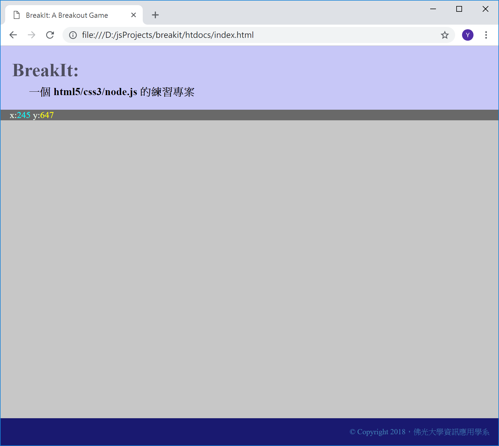

<!---
  @file       mouse.md
  @author     Yiwei Chiao (ywchiao@gmail.com)
  @date       10/19/2018 created.
  @date       10/19/2018 last modified.
  @version    0.1.0
  @since      0.1.0
  @copyright  CC-BY, © 2018 Yiwei Chiao
-->

## [DOM][mdnDOM] 滑鼠追蹤

 `htdocs/js/index.js` 的內容如下：

```javascript
 1. 'use strict';
 2.
 3. window.addEventListener('load', () => {
 4.   console.log("index.js loaded");
 5.
 6.   let desktop = document.querySelector('.site-body')
 7.
 8.   desktop.addEventListener('mousemove', (e) => {
 9.     document.getElementById('cursor-x').textContent = e.clientX;
10.     document.getElementById('cursor-y').textContent = e.clientY;
11.   });
12. });
```

  將以上的內容放到 `htdocs/js/index.js` 檔案內之後，在瀏覽器內移動
  滑鼠，應該可以看見螢幕左上角的 `x:` 和 `y:` 後面的數字在跟著變化。

## APIs 說明

  目前的 `index.js` 使用了兩個 [DOM][mdnDOM] 的*查詢* APIs (API:
  APplication Interface 應用程式介面)

  * 第 6 行的 **querySelector(...)**
  * 第 9 和第 10 行的 **getElementById(...)**

### `querySelector(...)`

  在介紹 [CSS][mdnCSS] 時提到，瀏覽器將 `.css` 檔內的 [CSS][mdnCSS]
  規則運用到 `.html` 的元素 (element) 時，是透過所謂的
  **CSS selector**(CSS *選擇器*) 來確認適用對象的。

  舉例而言，

  * `h1` 代表*所有* `<h1>` 元素
  * `.site-header` 代表 `class` 屬性值是 `site-header` 的 [HTML][mdnHTML5]
   元素；如 `<div class="site-header">`； `.site-header` 最前方的那個
   `.` 就代表後面的字串是 [CSS][mdnCSS] `class` 的名稱
  * `#userid` 代表 `id` 屬性值是 `userid` 的 [HTML][mdnHTML5]
   元素；如 `<input id="userid">`； `#userid` 最前面的那個
   `#` 代表後面的字串是 [CSS][mdnCSS] `id` 的名稱；一個 `.html` 檔裡
   `id` 是*唯一*的。

  [DOM][mdnDOM] api `querySelector` 這裡的 `Selector` 指得就是
  [CSS][mdnCSS] 的 `selector` 字串.

  所以，第 6 行的 

```javascript
 6.   let desktop = document.querySelector('.site-body')
```

  就是利用 [CSS][mdnCSS] 選擇器，在當下的 [DOM][mdnDOM} tree 裡尋
  找 `class` 屬性是`site-body` 的元素。對照 `index.html`，它找到
  的應該是第 17 行的 `article` 元素。

```html
17.       <article class="site-body">
```

### `mousemove` 事件

  找到 `<article>` 元素本身其實不是重點，重點在找到之後，為它加上一
  個 **mousemove** (滑鼠移動) 的事件處理程序，如 `index.js` 的第 8
  行：

```javascript
 8.   desktop.addEventListener('mousemove', (e) => {
 9.     document.getElementById('cursor-x').textContent = e.clientX;
10.     document.getElementById('cursor-y').textContent = e.clientY;
11.   });
```

 `mousemove` 事件，如它的名字所示，每當瀏覽器偵測到滑鼠移動時，就會
 觸發。這裡將利用這個事件取得滑鼠當下的螢幕座標，就是第 9, 10 行裡
 的 `e.clientX` 和 `e.clientY`，同時將它顯示在左上角。

### `getElementById`

 為了將取得的滑鼠 `(x, y)` 座標顯示在螢幕上；需要取得相對應的
 [HTML][mdnHTML5] 元素；這裡使用了 `getElementById()` 來取得擁有
 特定 [CSS][mdnCSS] `id` 的 [HTML][mdnHTML5] 元素。

 對照 `index.html`，對應的元素就是第 20, 21 行的 `<span>` 元素：

```html
20.             x:<span id="cursor-x">0</span>
21.             y:<span id="cursor-y">0</span>
```

 取得 `<span>` 元素後，更改它的內容就是直接設定 `<span>` 元素的
 `textContent` 屬性。

 最後執行如圖 \ref{mousetracing}：

  

### `querySelector(...)` 與 `getElementById(...)`

 到目前為止，可能會有一個問題，既然 `querySelector(...)` 可以利用
 [CSS][mdnCSS] selector 選擇器來取得對應的 [DOM][mdnDOM] 元素，為
 什麼還需要一個 `getElementById(...)` 函數**只能**取得特定
 [CSS][mdnCSS] id 元素的函數？

 這是因為技術的快速演進。

 早期瀏覽器只有支援 `getElementById` 函數；但隨著 Web 技術的快速演
 進與 Web 應用的深入和普及，Web 應用程式需要對 [DOM][mdnDOM] 有更
 多的控制，所以才有了 `querySelector` 這個更一般化，和 [CSS][mdnCSS]
 整合的更好的函數出現。


## 思考與練習

  * 將 `index.js` 裡第 9, 10 行的 `getElementById` 修改成使用
   `querySelector` 的版本。除了函數名稱更改外，函數參數要作什麼樣
   的修改嗎？
  * 查一下網路資訊，找找在 [DOM][mdnDOM] APIs 裡：
    + `mousemove` event 提供的座標資訊有哪些，它們間的異同點在？
    + 滑鼠事件除了 `mousemove` 外，還有那些可以用？它們分別在什麼時
     機點會被觸發？

[mdnCSS]: https://developer.mozilla.org/en-US/docs/Web/CSS
[mdnDOM]: https://developer.mozilla.org/en-US/docs/Web/API/Document_Object_Model
[mdnHTML5]: https://developer.mozilla.org/en-US/docs/Web/Guide/HTML/HTML5
[mdnJavaScript]: https://developer.mozilla.org/zh-TW/docs/Web/JavaScript
[breakit]: https://github.com/ywchiao/breakit.git

<!-- mouse.md -->
