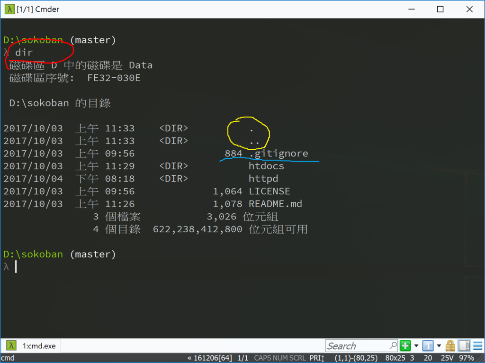
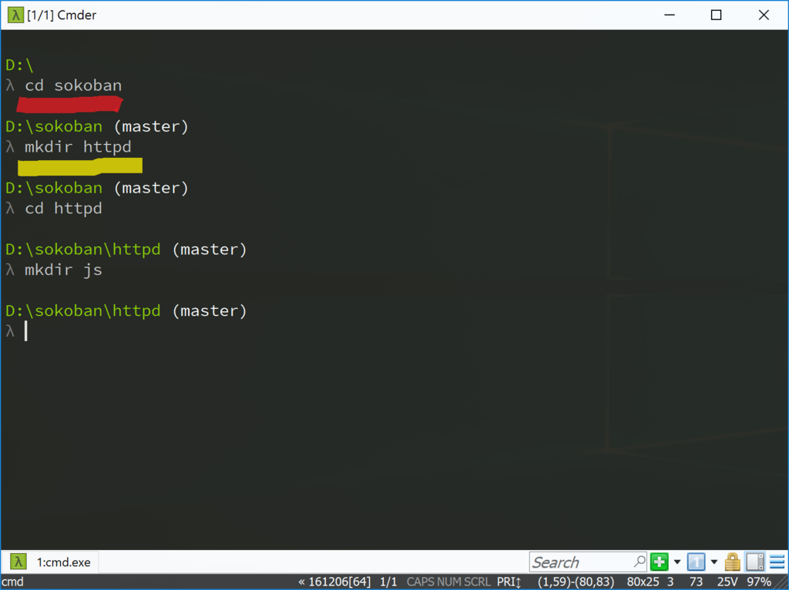
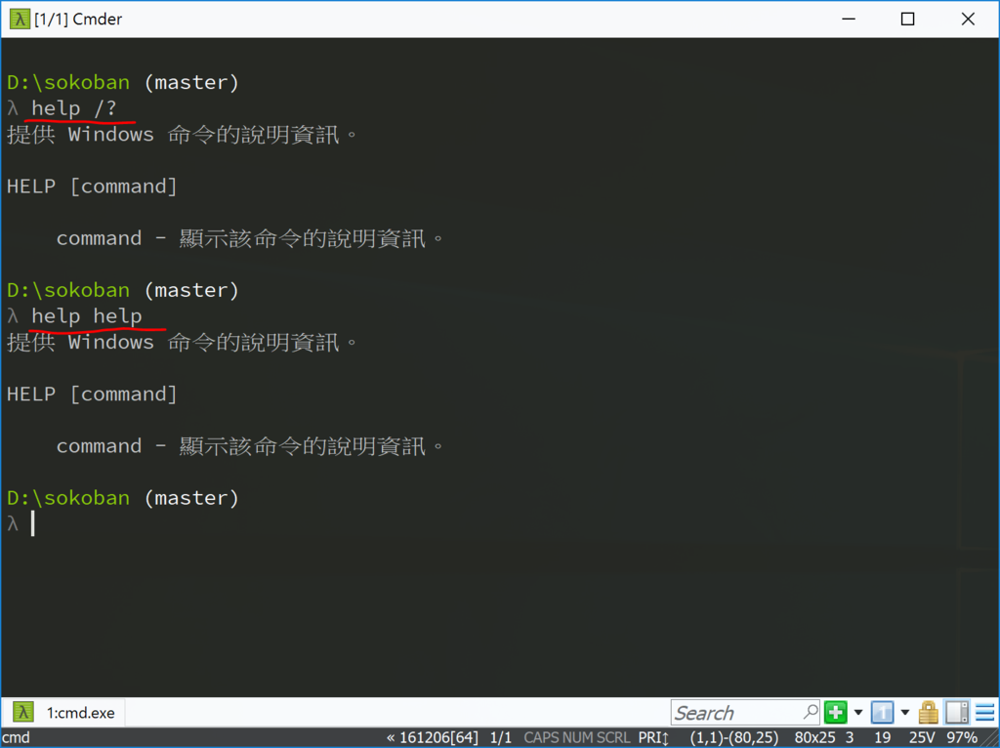

<!---
  @file       shell_basics.md
  @author     Yiwei Chiao (ywchiao@gmail.com)
  @date       10/05/2017 created.
  @date       10/05/2017 last modified.
  @version    0.1.0
  @copyright  CC-BY, (C) 2017 Yiwei Chiao
-->

# 基本 shell 指令

  這一小節簡單介紹在命令提示字元/terminal 下的操作指令，一般稱為 shell 指令。
  基本目標為能夠在命令提示字元/terminal 環境下，於專案的目錄結構自在往來為主。
  範例圖式以 Windows 為主， Linux/MacOS 指令若有差異會再註明。

## `dir`: 列出檔案列表

  

　如 Figure \ref{cmd_dir} 紅色圈起來的地方所示。在 Windows 環境的命令提示字
  字元下輸入指令：`dir`，命令提示字元會列出檔前資料夾下所有的檔案。

  專案發展過程，如果需要知道目前所在資料夾，資料夾下有沒有特定檔案，有那些檔案，
  都可以利用這個指令來查看。

  `dir` 指令名稱的來源來自英文的**目錄** (*DIRectory*。)

  對應的，Linux/MacOS 環境的相對指令稱為 `ls`。`ls` 的命令名稱來源，你猜到
  了。英文的**列出** (*LiSt* directory。)

  在 Figure \ref{cmd_dir} 裡還有幾點值得一提：

  * 當前目錄: *.* 與 上層目錄: *..*: 在 Figure \ref{cmd_dir} 裡可以看到
   用黃線圈起來的 *.* 和 *..*，其中，
   - *.*: 代表 **當前** 資料夾，而
   - *..*: 代表 **上一層** 資料夾。
   在某些指令操作場合很好用。舉例而言，`cd ..` 代表切換到上一層資料夾。
  * 畫藍色底線的 *.gitignore*。記得，在 Windows 環境，檔名/目錄名前的 *.*
   沒有意義，但在 Linux/MacOS 環境下，代表 **隱藏檔**，也就是，沒特別指定的
   話， `ls` 指令不會顯示名稱以 *.* 開頭的檔案或資料夾。

## `cd`: 切換資料夾

  如果要移動到不同的資料夾下工作。使用的指是： `cd`，也就是英文的 *Change Directory*。如 Figure \ref{dir_httpd}，畫紅色底線的部份。

  

  如在 Figure \ref{cmd_dir} 裡說明的，`cd ..` 代表切換至上層目錄；而這是可
  以組合的。意思是說： `cd ..\..` 代表移至上兩層目錄，`cd ..\..\..` 代表移
  到上三層目錄等。

  這裡要注意的是 `cd ..\..` 裡的 `\` (*backslash* 字元)；這個 `\` 字元
  用來作為 **路徑** (*path*) 的資料夾分隔字元；但是，同樣的目的，
  Linux/MacOS 使用的是 `/` (*slash*) 字元。

## `md` 或 `mkdir`: 建立資料夾

  Figure \ref{dir_httpd} 裡，畫黃線的部份，呼叫 `mkdir` 來建立新資料夾；同樣指令也可簡寫為 `md` (*Make Directory*。)

## 指令說明/幫助

  如果對這些指令還有疑問或想查有沒有進階的用法。除了上網問 Google，現在的作業
  環境都附痈完善的線上說明。

  

  如 Figure \ref{cmd_help} 所示，在 Windows 環境下有兩種取得指令說明的
  方式：

  * `cmd /?` 和
  * `help cmd`

  注意第一種方式的 `/` (slash) 字元在 Linux/MacOS 是用作目錄分隔符號。

  在 Linux/MacOS 環境下，則簡單的輸入：

  * `man cmd` 就行； `man` 來自 **手冊** 的英文 `MANual`；可以先
  * `man man` 查詢 `man` 指令本身的用法。

<!--- shell_basics.md -->
